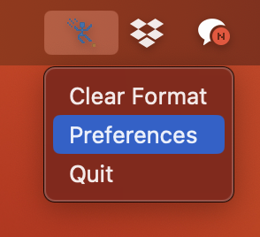
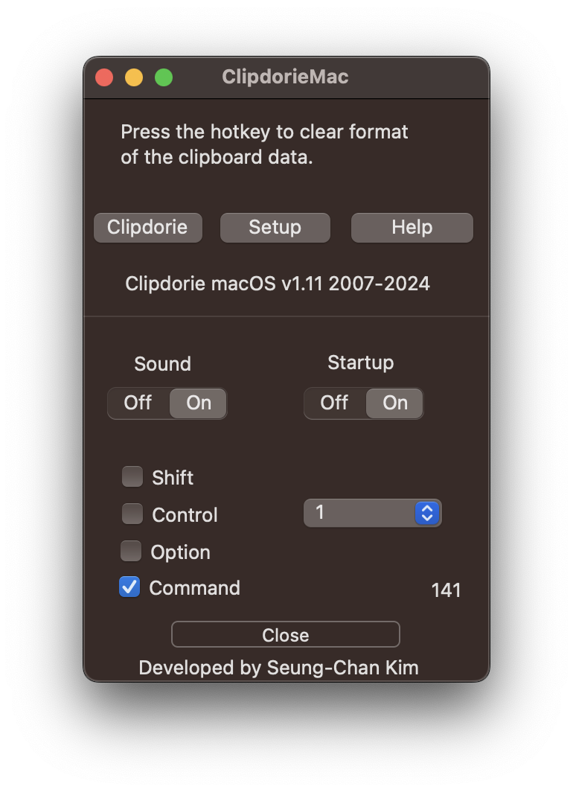
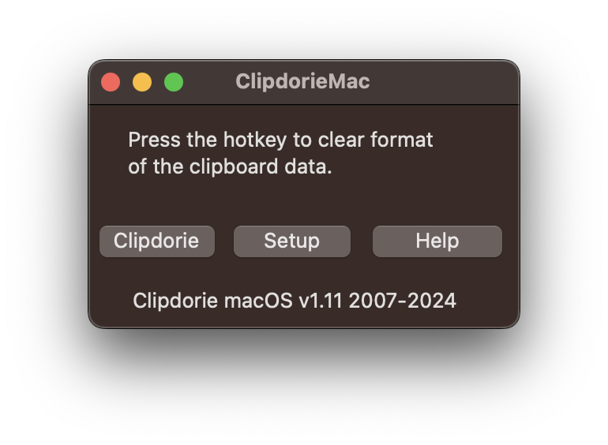

# Clipdorie-release
클립돌이 실행파일 (binary) 기존 버젼 배포 위치

# Clipdorie on macOS
### Purpose
ClipdorieMac aims to streamline the macOS user experience by offering quick, keyboard-driven commands to manipulate and manage clipboard content. It's particularly useful for users who frequently work with text and require efficient ways to clean up formatting, adjust text case, or perform custom text processing without leaving their current workflow. By automating these tasks, ClipdorieMac saves time and reduces the need for manual text adjustments or using multiple applications to achieve simple text transformations.

### Revision history ###
* Version 1.11 released on 2024 February.
* Version 1.1 released on 2020 March.
* Version 1.0 released on 2012 Spring.

### How to use ? ###

**Using ClipdorieMac**:
   - **Copy Text**: First, copy the text you wish to manipulate to your clipboard.
   - **Activate Hotkey**: Press the predefined hotkey (e.g., "Command + 1") to perform the desired action on the clipboard text. For example, if you've configured a hotkey to clear formatting, pressing it will immediately strip formatting from the copied text.
   - **Result**: The manipulated text is now on your clipboard, ready to be pasted wherever you need it.

**Using the Hotkey**: The magic happens with the predefined hotkey, typically set to Command + 1 (adjustable). This hotkey is your gateway to cycling through a series of text manipulations with each press. Here's what each press does to the text you've copied to your clipboard:

   - **First Press**: Clears formatting and removes extra white spaces, such as spaces before or after sentences. This is perfect for cleaning up text copied from the web or a document.
   - **Second Press**: Removes new line characters and trims any leading or trailing white spaces. Ideal for turning copied multi-line text into a single, neat paragraph.
   - **Third Press**: Converts all your text to lowercase, making it uniform and easy to read.
   - **Fourth Press**: Transforms all your text to uppercase for emphasis or titles.

**Configuring Hotkeys**: By default, the hotkey is set to "Command + 1". This can be customized to suit your preferences. To change the hotkey:

   - Click on the ClipdorieMac icon in the menu bar and select "Preferences".
   - Press the "Setup" button.
   - Navigate to the "Hotkeys" section.
   - Input your desired key combination for the action.

### Screenshots ###
 
